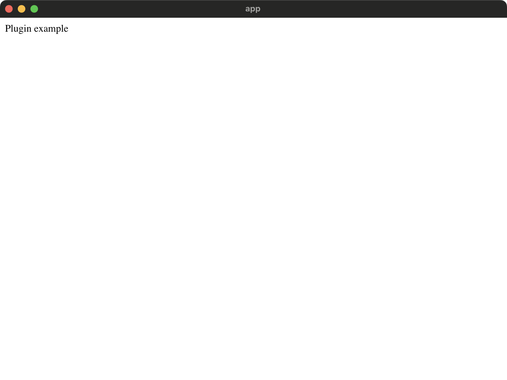

# Basic Panel Example

This example demonstrates the basic usage of tauri-nspanel: converting a standard Tauri window into an NSPanel with custom configuration and event handlers.



## What it does

- Creates a standard Tauri application window
- Converts it to a custom NSPanel using `window.to_panel::<Panel>()`
- Configures panel with `canBecomeKeyWindow: true` and `canBecomeMainWindow: false`
- Sets up event handlers for window focus events
- Provides commands to show/hide/close the panel from JavaScript

## Key Features Demonstrated

- Using `tauri_panel!` macro to define custom panel class
- Converting WebviewWindow to custom Panel type
- Setting up event handlers for `window_did_become_key` and `window_did_resign_key`
- Querying panel properties (class name, can become key/main)
- Frontend commands for panel control

## Running the Example

```bash
pnpm install
pnpm tauri dev
```

## Code Overview

The main logic in `src-tauri/src/main.rs`:

```rust
// Define custom panel with configuration
tauri_panel! {
    panel!(Panel {
        config: {
            canBecomeKeyWindow: true,
            canBecomeMainWindow: false
        }
    })
    
    panel_event!(PanelEventHandler {
        window_did_become_key(notification: &NSNotification) -> (),
        window_did_resign_key(notification: &NSNotification) -> ()
    })
}

// Convert window to panel
let panel = window.to_panel::<Panel>().unwrap();

// Set up event handlers
let handler = PanelEventHandler::new();
handler.window_did_become_key(|notification| {
    println!("Panel became key window!");
});
panel.set_event_handler(Some(handler.as_ref()));
```

## Available Commands

- `show_panel` - Shows the panel
- `hide_panel` - Hides the panel
- `close_panel` - Closes and releases the panel

## Learn More

- See the [tauri-nspanel documentation](https://github.com/ahkohd/tauri-nspanel) for more details
- Check out other examples for more advanced features like mouse tracking, panel builders, and fullscreen support
