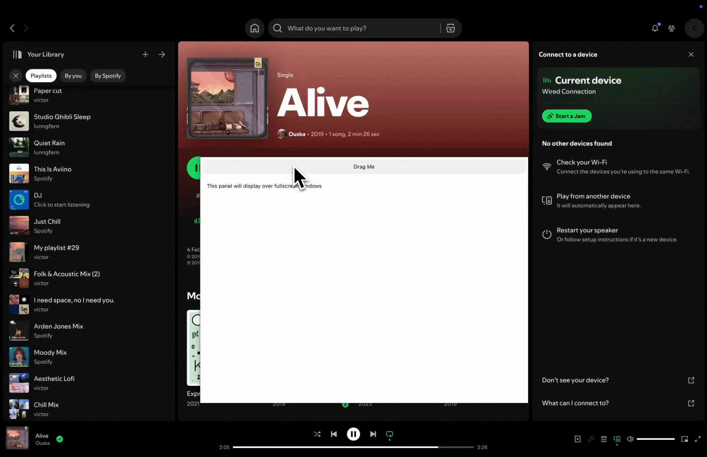

# Fullscreen Example

This example demonstrates how to create a panel that can display over fullscreen windows using [tauri-nspanel](https://github.com/ahkohd/tauri-nspanel).



## Features Demonstrated

- Panel that floats above fullscreen applications
- Non-activating panel behavior
- Cross-space panel display
- Draggable panel with proper permissions

## Running the Example

```bash
cd examples/fullscreen
npm install
npm run tauri dev
```

## Key Implementation Details

### 1. Window Configuration
Configure the window in `tauri.conf.json` by setting `decorations` and `fullscreen` to false:

```json
{
    "windows": [{
        "decorations": false,
        "fullscreen": false
    }]
}
```

### 2. Set Activation Policy (Optional)
Set the app's activation policy to auxiliary during startup to prevent the app icon from appearing in the dock:

```rust
.setup(|app| {
    // Set activation policy to Accessory to prevent the app icon from showing on the dock
    app.set_activation_policy(tauri::ActivationPolicy::Accessory);
    
    init(app.app_handle());
    
    Ok(())
})
```

### 3. Panel Configuration
Configure the panel with the necessary properties to display over fullscreen windows:

```rust
use tauri_nspanel::{PanelLevel, StyleMask, CollectionBehavior};

// Set floating window level
panel.set_level(PanelLevel::Floating.value());

// Prevent panel from activating the app (required for fullscreen display)
panel.set_style_mask(
    StyleMask::empty()
        .nonactivating_panel()
        .resizable()  // Optional: make panel resizable
        .into()
);

// Allow panel to display over fullscreen windows and join all spaces
panel.set_collection_behavior(
    CollectionBehavior::new()
        .full_screen_auxiliary()
        .can_join_all_spaces()
        .into()
);

// Optional: prevent panel from hiding when app deactivates
panel.set_hides_on_deactivate(false);
```

Available panel levels for different use cases:
- `PanelLevel::Normal` - Normal window level
- `PanelLevel::Floating` - Floats above normal windows
- `PanelLevel::SubmenuFloating` - Floats above submenus
- `PanelLevel::MainMenu` - Main menu level
- `PanelLevel::Status` - Status window level (highest level)
- `PanelLevel::PopUpMenu` - Pop-up menu level
- `PanelLevel::ScreenSaver` - Screen saver level
### 4. Add A Drag Region (Optional)
To make the panel draggable, add a drag region in your HTML:

```html
<div data-tauri-drag-region class="drag-area">
    Drag Me
</div>
```

Add the required permissions in your capability file:

```json
{
  "permissions": [
    "core:window:allow-start-dragging",
    "core:window:deny-internal-toggle-maximize"
  ]
}
```

The `deny-internal-toggle-maximize` permission is important because:
- Panels configured for fullscreen display cannot become fullscreen or be maximized
- Double-clicking the drag region normally maximizes the window on macOS
- This permission prevents the default maximize behavior which would crash the panel

## Important Notes

- **Never call `maximize()` or `fullscreen()`** on a panel configured to display over fullscreen windows - this will crash
- The panel must be non-activating to display over fullscreen windows
- Use `full_screen_auxiliary()` collection behavior to ensure proper fullscreen display
- The panel can be configured to appear on all spaces with `can_join_all_spaces()`

## Complete Example

See the [main.rs](./src-tauri/src/main.rs) file for a complete implementation showing all these concepts working together.
