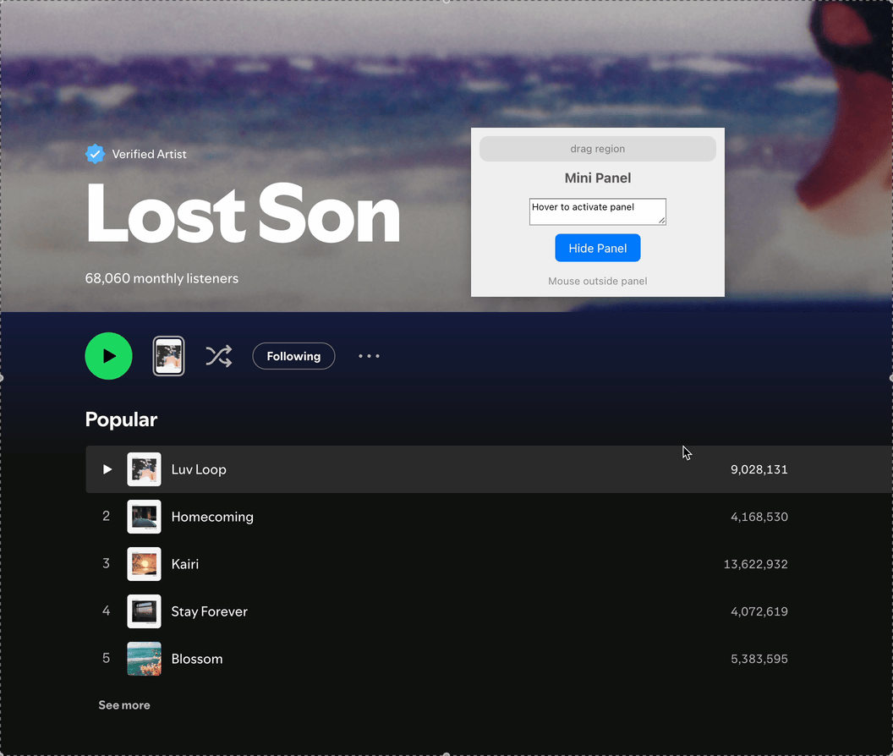

# Hover Activate Example

This example demonstrates an advanced panel behavior where the panel automatically becomes the key window when the mouse hovers over it, and resigns key status when the mouse leaves. This creates a seamless user experience for floating utility panels.



## Features Demonstrated

- Automatic Key Window Management: Panel becomes key on mouse enter, resigns on mouse exit
- Mouse Tracking with Actions: Using mouse events to trigger window state changes
- Non-Activating Panel: Panel doesn't activate the app when clicked
- Floating Panel Behavior: Always stays above other windows
- Cross-Space Display: Shows on all spaces and over fullscreen windows

## Running the Example

```bash
npm install
npm run tauri dev
```

Once running, hover your mouse over the floating panel to see it automatically become the key window. Move your mouse away to see it resign key status.

## Key Implementation Details

### 1. Panel Configuration

The panel is configured with specific behaviors for hover activation:

```rust
tauri_panel! {
    panel!(HoverActivatePanel {
        config: {
            can_become_main_window: false,     // But not main window
            can_become_key_window: true,      // Can become key window
            becomes_key_only_if_needed: true, // Always becomes key when requested
            is_floating_panel: true         // A floating panel
        }
        with: {
            tracking_area: {
                options: TrackingAreaOptions::new()
                    .active_always()           // Track even when app is inactive
                    .mouse_entered_and_exited() // Get hover notifications
                    .mouse_moved()             // Track mouse movement
                    .cursor_update(),          // Track cursor updates
                auto_resize: true              // Resize tracking area with window
            }
        }
    })
    
    panel_event!(MyPanelEventHandler {})
}
```

### 2. Hover Activation Logic

The key functionality is implemented through mouse event callbacks that manage the window's key status:

```rust
let handler = MyPanelEventHandler::new();

// Make panel key when mouse enters
handler.on_mouse_entered(move |_event| {
    println!("🐭 Mouse entered the panel, make it key!");
    let panel = handle.get_webview_panel("main").unwrap();
    panel.make_key_window();
});

// Resign key when mouse exits
handler.on_mouse_exited(move |_event| {
    println!("👋 Mouse exited the panel!");
    let panel = handle.get_webview_panel("main").unwrap();
    panel.resign_key_window();
});
```

### 3. Panel Behavior Configuration

Additional panel behaviors are configured to create the desired floating utility experience:

```rust
// Set floating level - stays above other windows
panel.set_level(PanelLevel::Floating.value());

// Prevent app activation when clicked
panel.set_style_mask(StyleMask::empty().nonactivating_panel().into());

// Allow display over fullscreen windows and on all spaces
panel.set_collection_behavior(
    CollectionBehavior::new()
        .full_screen_auxiliary()
        .can_join_all_spaces()
        .into()
);

// Don't hide when app deactivates
panel.set_hides_on_deactivate(false);

// Receive keyboard and mouse events even
// when another window in the application is running modally
panel.set_works_when_modal(true);

// Attach the event handler
panel.set_event_handler(Some(handler.as_ref()));
```

## How It Works

1. Mouse Enter: When the mouse enters the panel bounds, the `on_mouse_entered` callback fires and calls `panel.make_key_window()`
2. Panel Becomes Key: The panel receives keyboard focus and the `window_did_become_key` callback logs the state
3. Mouse Exit: When the mouse leaves the panel bounds, the `on_mouse_exited` callback fires and calls `panel.resign_key_window()`
4. Panel Resigns Key: The panel loses keyboard focus and the previous window regains it

## Behavior Notes

- The panel only accepts key status when `can_become_key_window` is true
- The `nonactivating_panel` style prevents the app from coming to the foreground
- Mouse tracking works even when the app is not active due to `active_always()`
- The panel maintains its floating position across all spaces

## Frontend Integration

The panel uses a simple HTML interface with controls to test the behavior:

```html
<button onclick="hidePanel()">Hide Panel</button>
```

Commands are exposed to the frontend:
- `show_panel`: Display the panel
- `hide_panel`: Hide the panel without closing
- `close_panel`: Close and destroy the panel
