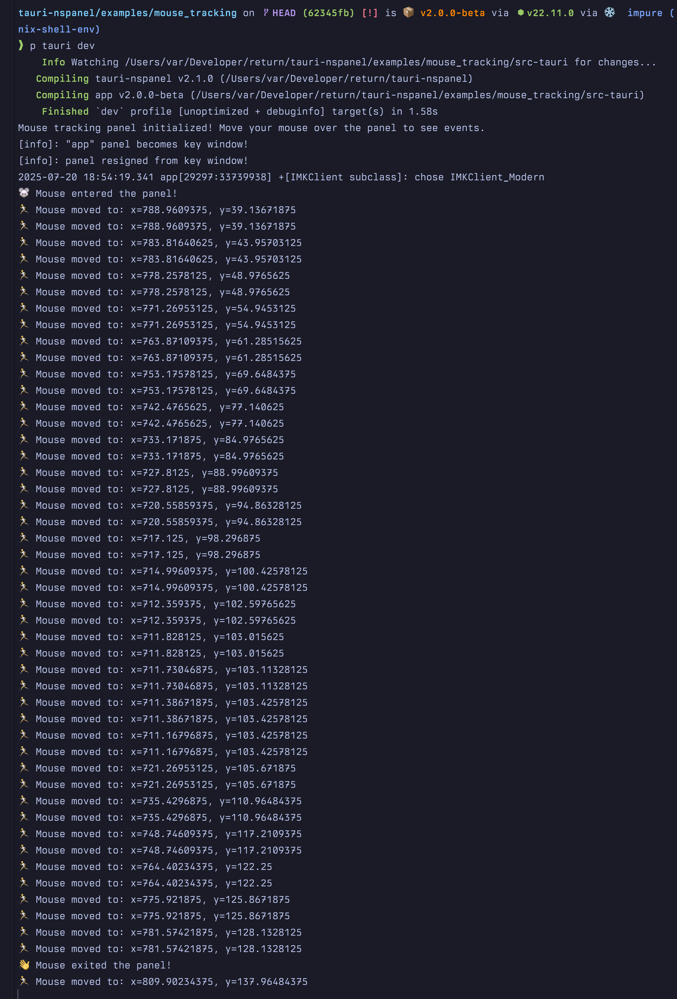

# Mouse Tracking Demo

This example demonstrates how to use mouse tracking events with [tauri-nspanel](https://github.com/ahkohd/tauri-nspanel). It shows how to configure a panel with a tracking area and handle mouse events like enter, exit, move, and cursor updates.



## Features Demonstrated

- Setting up a panel with mouse tracking area
- Handling mouse enter/exit events
- Tracking mouse movement with coordinates
- Cursor update events

## Running the Demo

```bash
pnpm install
pnpm tauri dev
```

Once running, move your mouse over the panel window to see mouse tracking events logged to the console.

## Key Implementation Details

### 1. Panel Configuration with Tracking Area

The panel is configured with a tracking area in the macro definition:

```rust
tauri_panel! {
    panel!(MouseTrackingPanel {
        config: {
            canBecomeKeyWindow: true,
            canBecomeMainWindow: false,
            isFloatingPanel: true
        }
        with: {
            tracking_area: {
                options: TrackingAreaOptions::new()
                    .active_always()           // Track even when app isn't active
                    .mouse_entered_and_exited() // Get enter/exit notifications
                    .mouse_moved()             // Track mouse movement
                    .cursor_update(),          // Track cursor updates
                auto_resize: true               // Resize tracking area with window
            }
        }
    })
    
    panel_event!(MyPanelEventHandler {
        window_did_become_key(notification: &NSNotification) -> (),
        window_did_resign_key(notification: &NSNotification) -> ()
    })
}
```

### 2. Setting Up Mouse Event Callbacks

Mouse event callbacks are set on the event handler, not directly on the panel:

```rust
// Create event handler
let handler = MyPanelEventHandler::new();

// Mouse entered the panel
handler.on_mouse_entered(|event| {
    println!("🐭 Mouse entered the panel!");
});

// Mouse exited the panel
handler.on_mouse_exited(|event| {
    println!("👋 Mouse exited the panel!");
});

// Mouse moved within the panel
handler.on_mouse_moved(|event| {
    // Get the mouse location relative to the window
    let location = unsafe { event.locationInWindow() };
    println!("🏃 Mouse moved to: x={}, y={}", location.x, location.y);
});

// Cursor update requested
handler.on_cursor_update(|event| {
    println!("👆 Cursor update requested");
});

// Attach the handler to the panel
panel.set_event_handler(Some(handler.as_ref()));
```

### 3. Tracking Area Options

The `TrackingAreaOptions` builder provides various configuration options:

- `active_always()` - Track mouse even when the application is not active
- `active_in_active_app()` - Only track when the app is active
- `active_in_key_window()` - Only track when the window is key
- `mouse_entered_and_exited()` - Get notifications when mouse enters/exits
- `mouse_moved()` - Track mouse movement
- `cursor_update()` - Get cursor update events
- `assume_inside()` - Assume mouse is initially inside the tracking area
- `in_visible_rect()` - Track only in the visible portion of the view

### 4. Accessing Event Data

The mouse event callbacks receive an `&NSEvent` parameter from objc2-app-kit. You can access various properties:

```rust
// Get mouse location relative to window
let location = unsafe { event.locationInWindow() };

// Mouse location in screen coordinates (requires unsafe)
let screen_location = unsafe { event.locationInScreen() };

// Get event timestamp (requires unsafe)
let timestamp = unsafe { event.timestamp() };

// Get the event type
let event_type = unsafe { event.type_() };
```

## Integration with Frontend

To communicate mouse events to your frontend, you can:

1. Emit Tauri events from the callbacks
2. Store mouse position in a shared state
3. Create commands to query current mouse position

Example:
```rust
handler.on_mouse_moved(move |event| {
    let location = unsafe { event.locationInWindow() };
    // Emit to frontend
    app_handle.emit("mouse-position", json!({
        "x": location.x,
        "y": location.y
    })).ok();
});
```

## Notes

- Mouse tracking only works on macOS since it uses NSPanel-specific features
- The tracking area is attached to the panel's content view
- Coordinates are in the window's coordinate system (origin at bottom-left)
- For webview content, you may need to transform coordinates to match web coordinates
