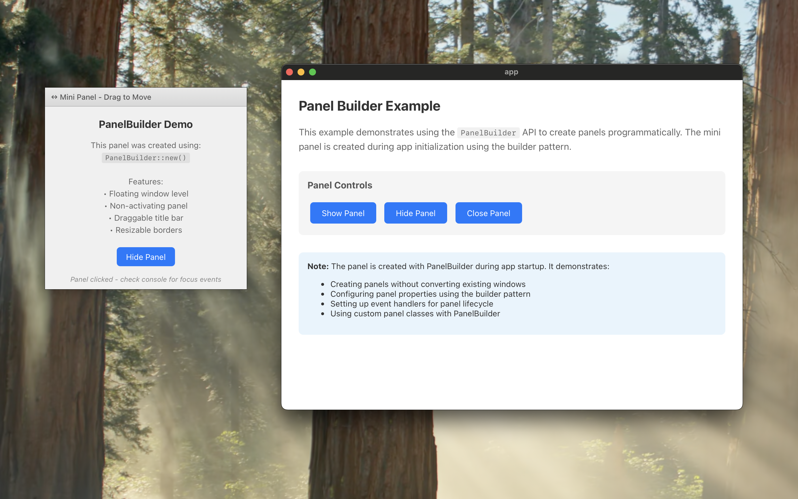

# Panel Builder Example

This example demonstrates how to use the `PanelBuilder` API to create NSPanel windows programmatically in a Tauri application.


## Features Demonstrated

- **Creating panels programmatically** using `PanelBuilder::new()`
- **Configuring panel properties** with the builder pattern
- **Adding drag regions** for window movement
- **Setting up event handlers** for panel lifecycle events
- **Managing multiple windows** (main window + floating panel)

## Running the Example

```bash
cd examples/panel_builder
npm install
npm run tauri dev
```

## Key Implementation Details

### 1. Using PanelBuilder

Unlike converting an existing window with `window.to_panel()`, PanelBuilder creates panels from scratch:

```rust
let panel = PanelBuilder::<_, MiniPanel>::new(app_handle, "mini-panel")
    .url(WebviewUrl::App("mini.html".into()))
    .title("Mini Panel")
    .position(Position::Logical(LogicalPosition::<f64> {
      x: 100.0,
      y: 100.0,
    }))
    .size(Size::Logical(LogicalSize::<f64> {
      width: 300.0,
      height: 200.0,
    }))
    .level(PanelLevel::Floating)
    .has_shadow(true)
    .collection_behavior(
      CollectionBehavior::new()
        .can_join_all_spaces()
        .stationary()
        .into(),
    )
    .hides_on_deactivate(false)
    .works_when_modal(true)
    .with_window(|w| w.decorations(false))
    .style_mask(StyleMask::empty().nonactivating_panel().resizable().into())
    .build()
    .expect("Failed to create mini panel");
```

### 2. Custom Panel Class

The example defines a custom panel class with specific configuration:

```rust
panel!(MiniPanel {
    config: {
        canBecomeKeyWindow: true,
        canBecomeMainWindow: false,
        isFloatingPanel: true
    }
})
```

### 3. Configuring Panel Behavior

The PanelBuilder API allows you to configure all panel properties directly in the builder chain, including style mask, collection behavior, and other settings. This is more convenient than setting them after creation.

### 4. Drag Region

The mini panel includes a drag region for window movement:

```html
<div data-tauri-drag-region class="drag-region">
    ↔ Mini Panel - Drag to Move
</div>
```

Required permissions in `capabilities/default.json`:
```json
{
    "permissions": [
        "core:window:allow-start-dragging",
        "core:window:deny-internal-toggle-maximize"
    ]
}
```

### 5. Event Handlers

The example shows how to attach event handlers to the panel:

```rust
let handler = MiniPanelEventHandler::new();

handler.window_did_become_key(move |notification| {
    println!("Mini panel became key window!");
});

handler.window_did_resign_key(|_notification| {
    println!("Mini panel resigned from key window!");
});

panel.set_event_handler(Some(handler.as_protocol_object()));

// Show the panel and make it key window
panel.show_and_make_key();
```

## PanelBuilder API Reference

### Builder Methods

#### Basic Configuration
- `new(handle, label)` - Create a new builder
- `url(WebviewUrl)` - Set the webview URL
- `title(String)` - Set the window title
- `position(Position)` - Set initial position
- `size(Size)` - Set initial size
- `content_size(Size)` - Set content size (excluding window decorations)

#### Panel-Specific Properties
- `floating(bool)` - Set whether panel floats above other windows
- `level(PanelLevel)` - Set window level (Floating, Status, etc.)
- `has_shadow(bool)` - Enable/disable window shadow
- `opaque(bool)` - Set panel opacity
- `alpha_value(f64)` - Set transparency (0.0 to 1.0)
- `hides_on_deactivate(bool)` - Hide panel when app deactivates
- `becomes_key_only_if_needed(bool)` - Panel becomes key window only if needed
- `accepts_mouse_moved_events(bool)` - Accept mouse moved events
- `ignores_mouse_events(bool)` - Ignore all mouse events
- `movable_by_window_background(bool)` - Allow dragging by background
- `released_when_closed(bool)` - Release panel when closed
- `works_when_modal(bool)` - Work with modal dialogs

#### Advanced Configuration
- `style_mask(StyleMask)` - Set window style mask
- `collection_behavior(CollectionBehavior)` - Set collection behavior
- `with_window(fn)` - Apply custom configuration to WebviewWindowBuilder

#### Build
- `build()` - Create the panel (returns `Result<Arc<dyn Panel>>`)

### Panel Levels

- `PanelLevel::Normal` - Standard window level
- `PanelLevel::Floating` - Floats above normal windows
- `PanelLevel::Status` - Status bar level (very high)
- `PanelLevel::MainMenu` - Main menu level
- `PanelLevel::PopUpMenu` - Pop-up menu level
- `PanelLevel::ScreenSaver` - Screen saver level

### Style Masks

- `nonactivating_panel()` - Panel doesn't activate the app
- `resizable()` - Allow window resizing
- `titled()` - Show title bar
- `closable()` - Show close button
- `miniaturizable()` - Show minimize button
- `borderless()` - Remove window chrome

### Collection Behaviors

- `can_join_all_spaces()` - Panel appears on all spaces
- `stationary()` - Panel doesn't move with spaces
- `full_screen_auxiliary()` - Can appear over fullscreen windows
- `ignores_cycle()` - Excluded from Cmd+Tab cycling

## Notes

- PanelBuilder is ideal for creating auxiliary windows like tool palettes, floating inspectors, or utility panels
- The panel is created during app initialization and persists throughout the app lifecycle
- Commands allow showing/hiding/closing the panel from the frontend
- The main window remains a standard window while the panel floats above it
- Mouse tracking areas can only be configured via the `panel!` macro's `with` section, not through PanelBuilder methods
